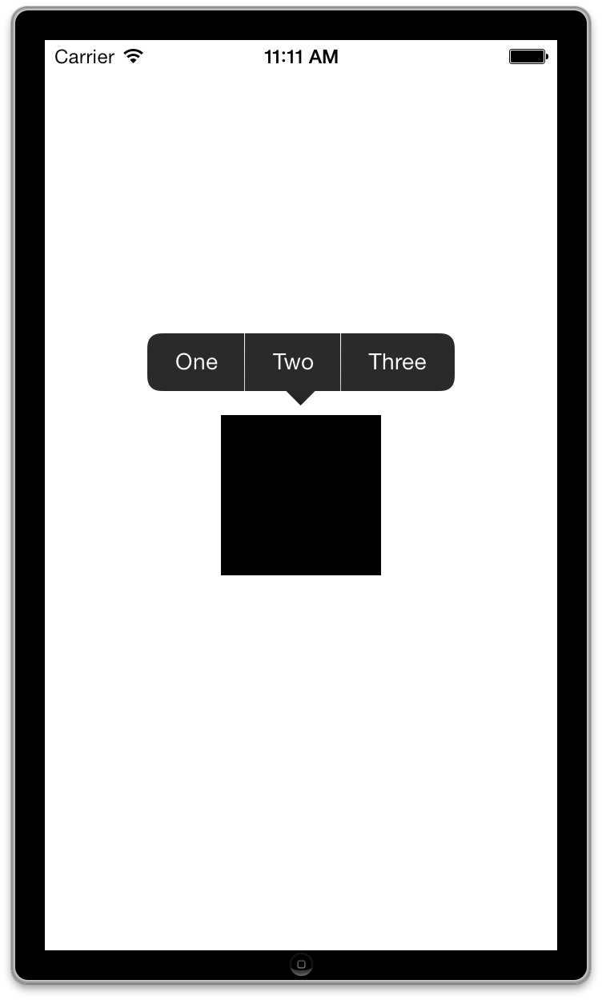

TiPopup
===========================================

Titanium Module for controlling the UIMenuController

## Installation

- Add or extract com.popup-iphone-0.1.zip into your modules folder located in **dist** folder
- Edit your tiapp.xml to add the module
- Build your Titanium project

## Usage

- View example/app.js for quick overview
- Tested working under the 3.2.1.GA SDK

		var win = Ti.UI.createWindow({
			backgroundColor:'white'
		});
		win.open();

		var TiPopup = require('com.popup');

		var popup = TiPopup.createPopupMenu();

		var block = Ti.UI.createView({
			width: 100,
			height: 100,
			backgroundColor: 'black'
		});

		win.add(block);
		win.add(popup);

		popup.create({
			items: ['One', 'Two', 'Three']
		});

		popup.addEventListener('click', function(e) {
			Ti.API.log('index: ' + e.index);
		});

		win.addEventListener('longpress', function() {
			popup.show({
				view: block
			});
		});

## Screenshot

